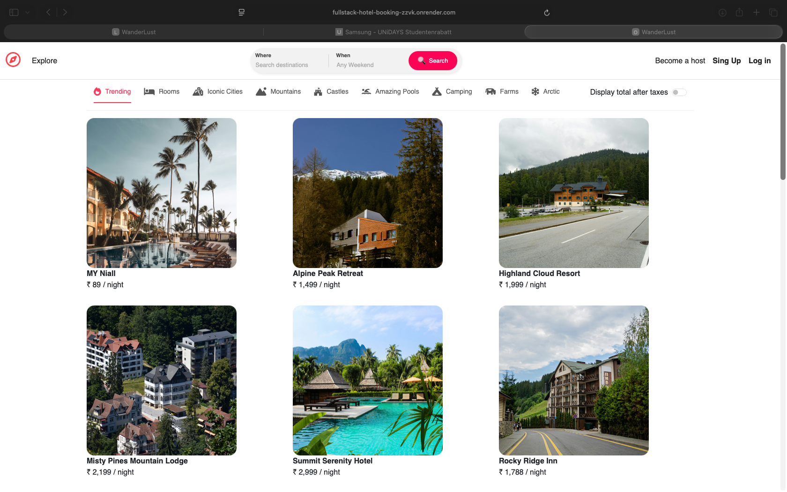
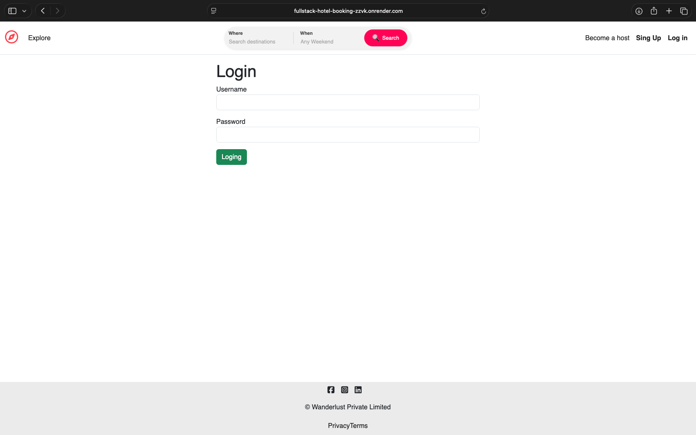
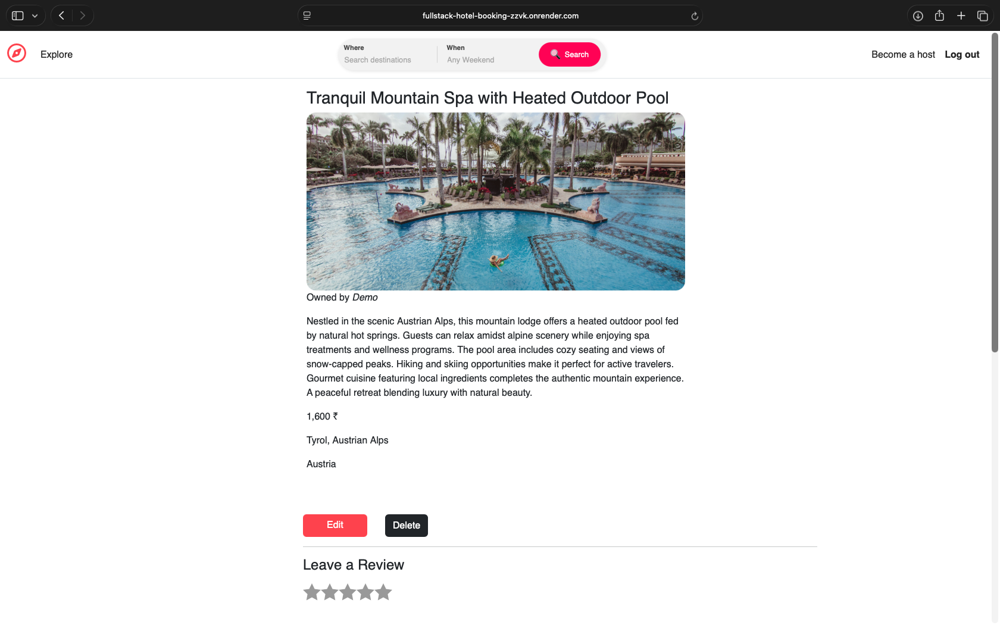
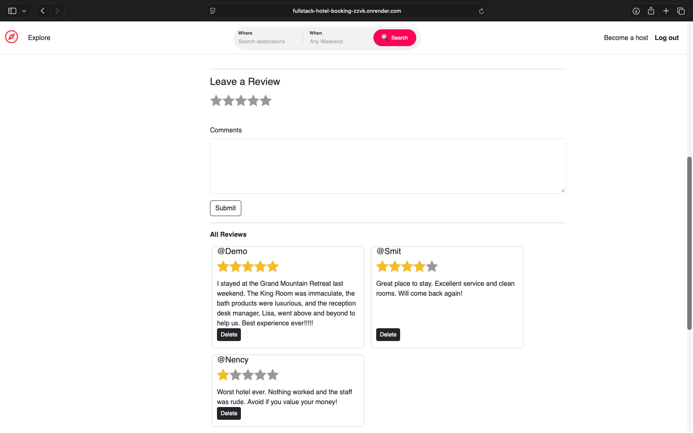
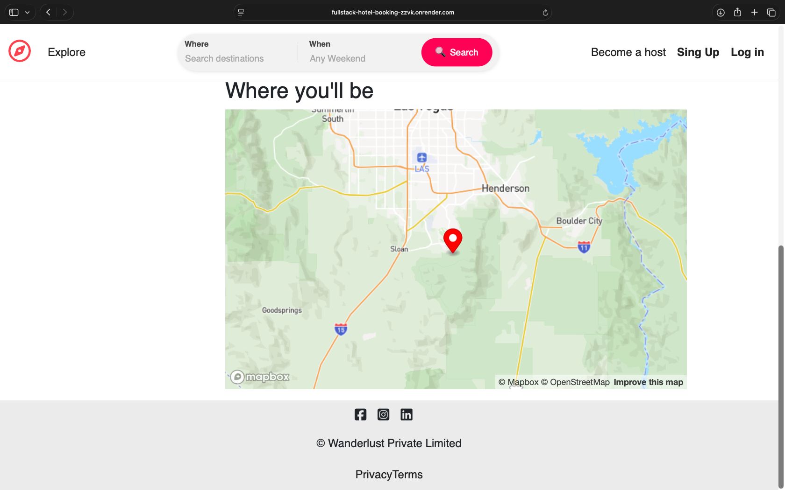
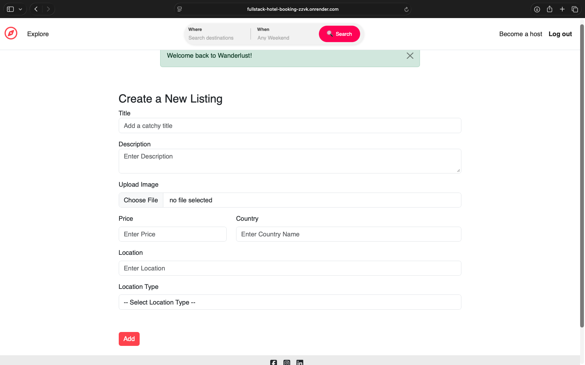
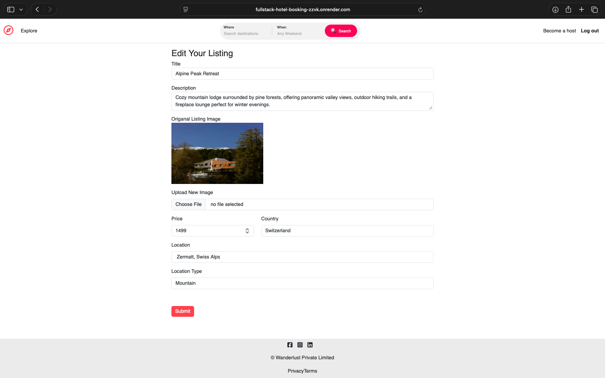

# 🚀 Fullstack Hotel Booking
---

## 📝 Project Overview

This is a Fullstack Hotel Booking Web Application where users can browse hotels, view rooms, and interact with hotel listings. The application supports frontend-only functionalities like searching and filtering hotels by location or date, while backend-powered features include registration/login using Passport.js, CRUD operations on hotels and rooms, image uploads, creating/editing/deleting listings, reviews, and live location map integration. The project is built with Node.js, Express.js, MongoDB, and EJS templates, and deployed on Render (with ~2–3 minutes cold start).

---

Link : https://fullstack-hotel-booking-zzvk.onrender.com

---

## 💻 Technologies Used
- **Backend:** Node.js, Express.js  
- **Database:** MongoDB, Mongoose  
- **Authentication:** Passport.js  
- **Frontend:** EJS, HTML, CSS, JavaScript  
- **Middleware:** Authentication, error handling  
- **Image Uploads:** Cloudinary  
- **Deployment:** Render  

## ✨ Features

### 🔹 Frontend & Backend (CRUD + Auth)
- **User Registration & Login:** Implemented with **Passport.js** for secure authentication.  
- **Hotel & Room Listings:** Create, edit, delete listings.  
- **Image Upload:** Upload images for hotels and rooms using Cloudinary.  
- **Reviews:** Users can submit reviews for hotels.  
- **Live Location Map:** Display hotels on a map with location markers.  

### 🔹 Frontend Only
- **Search & Filter:** Users can search hotels by location, date, or name (frontend only).  
- **Date Selection:** Check-in and check-out dates highlighted visually. 

---

## 🔧 CRUD Operations
- **Create:** Add new hotels/rooms/listings  
- **Read:** View hotel/room details  
- **Update:** Edit listings/Image 
- **Delete:** Remove listings or Reviews  

---
---

## screenshots

